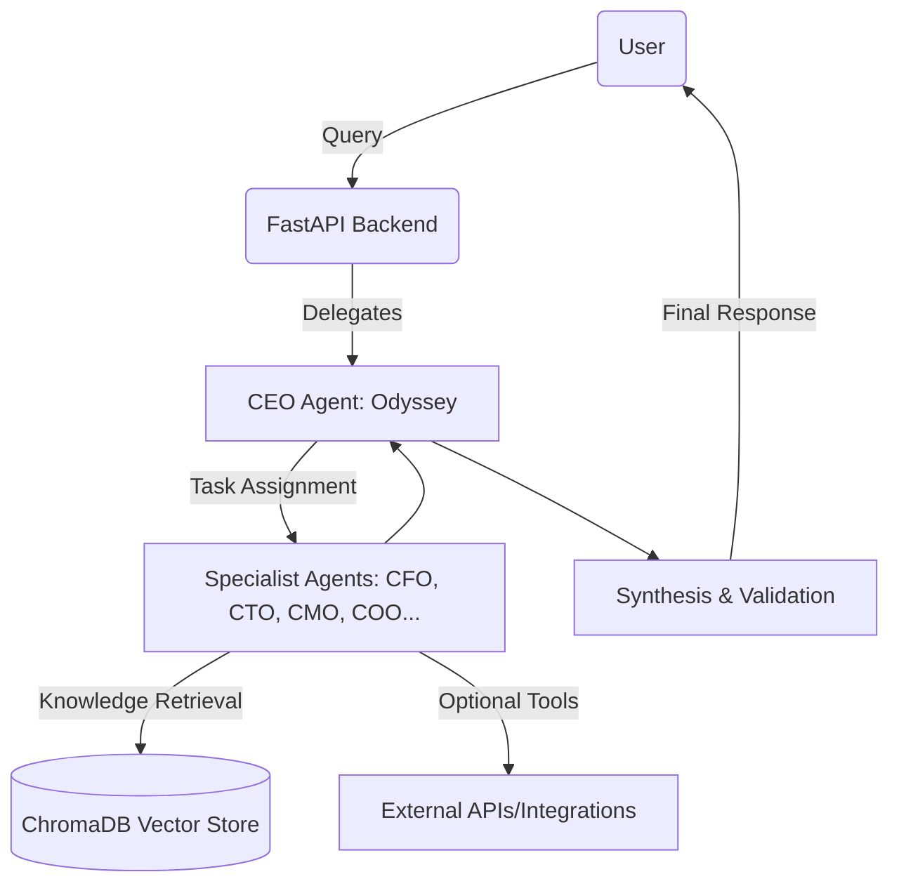

# 🎯 the_board

> **Multi-Agent Orchestration System for Strategic Intelligence**

[](https://www.python.org/downloads/)
[](https://fastapi.tiangolo.com/)
[](https://opensource.org/licenses/MIT)
[](https://github.com/ollama/ollama)

**the_board** is a groundbreaking collective intelligence system that orchestrates 20 specialized AI agents, each embodying the expertise of a world-class executive leader. Transform your high-level goals into actionable, multi-faceted strategies with an AI-powered "board of directors" that runs entirely on your local machine.

## 🚀 **What is the_board?**

Imagine having access to a full C-suite team (CEO, CFO, CTO, CMO, COO, and 15 other specialists) that can collaborate to solve complex business and strategic challenges. **the_board** makes this possible through:

- **🎭 20 Specialized AI Agents** - Each with distinct roles, expertise, and decision-making styles
- **🧠 Local-First Processing** - Complete data sovereignty using Ollama and local infrastructure
- **🔄 Self-Improving System** - Continuous learning from execution outcomes and feedback
- **🎯 Strategic Orchestration** - Intelligent task decomposition and multi-agent collaboration
- **📊 Comprehensive Knowledge Base** - ChromaDB-powered memory with citation tracking

## ✨ **Key Features**

### **🤖 Multi-Agent Intelligence**

**Essential Five (Core Agents):**

- **Odyssey (CEO)** - Master orchestrator and goal decomposer
- **Momentum (COO)** - Execution and operational excellence
- **Abacus (CFO)** - Financial modeling and budget optimization
- **Nexus (CTO)** - Technical architecture and tool evaluation
- **Muse (CMO)** - Marketing strategy and brand positioning

**Additional Specialists:**

- **Curio (Chief Researcher)** - Knowledge base maintenance and research
- **Guardian (CISO)** - Security, compliance, and risk oversight
- **Pulse (CHRO)** - Organizational design and team dynamics
- **Insight (CIO)** - Data strategy and analytics
- **And 10 more specialized agents...**

### **🔒 Privacy & Control**

- **100% Local Processing** - No data leaves your machine without permission
- **Complete Audit Trails** - Full visibility into decision-making processes
- **Configurable Security** - Granular control over data access and sharing
- **Human-in-the-Loop** - Escalation and oversight when needed

### **📈 Strategic Capabilities**

- **Goal Decomposition** - Break complex objectives into actionable tasks
- **Parallel Execution** - Multiple agents working simultaneously
- **Conflict Resolution** - Structured debate and consensus building
- **Synthesis Engine** - Cohesive output from diverse expertise
- **Risk Assessment** - Comprehensive analysis of potential challenges

## 🏗️ **Architecture Overview**

**Pattern:** Multi-Agent Orchestration with Centralized Knowledge (Hub-and-Spoke)



### **Core Components**

- **FastAPI Backend** - Entry point (`src/main.py`) with Pydantic v2 contracts
- **Orchestration Engine** - CEO Agent routes tasks and manages execution
- **Specialist Agents** - 20 specialized executives with distinct expertise
- **Knowledge Layer** - ChromaDB vector store with configurable embeddings
- **State Layer** - SQLite persistence with WAL mode for reliability
- **Synthesis Layer** - Conflict resolution and branded output formatting

## 🚀 **Quick Start**

### **Prerequisites**

- Python 3.11+
- [Ollama](https://ollama.ai/) installed and running
- Poetry (for dependency management)

### **Installation & Setup**

1. **Clone the repository**

   ```bash
   git clone https://github.com/yourusername/the_board.git
   cd the_board
   ```

2. **Install dependencies**

   ```bash
   poetry install
   ```

3. **Set up environment**

   ```bash
   cp example.env .env
   # Edit .env with your preferred settings
   ```

4. **Start Ollama and download models**

   ```bash
   ollama serve
   ollama pull llama3.2
   ollama pull mxbai-embed-large
   ```

5. **Launch the system**

   **Development mode (with auto-reload):**

   ```bash
   poetry run dev
   ```

   **Production mode:**

   ```bash
   poetry run start
   ```

   **Direct launch (canonical entry point):**

   ```bash
   poetry run uvicorn src.main:app --host 0.0.0.0 --port 8000
   ```

The system will be available at `http://localhost:8000`

**Note:** The canonical entry point is `src/main.py` - this is the main FastAPI application that contains the core API endpoints and state management.

## 📖 **Usage Examples**

### **Basic API Endpoints**

```bash
# Health check
curl "http://localhost:8000/health"

# Echo endpoint (demo)
curl -X POST "http://localhost:8000/echo" \
  -H "Content-Type: application/json" \
  -d '{"text": "Hello, the_board!"}'

# Ready check (with dependency validation)
curl "http://localhost:8000/readyz"
```

### **Strategic Planning (Future Implementation)**

```bash
# Submit a strategic goal (when implemented)
curl -X POST "http://localhost:8000/plan" \
  -H "Content-Type: application/json" \
  -d '{
    "high_level_goal": "Launch a SaaS product for small business accounting",
    "user_context": "I have 2 years of accounting experience and $50k budget"
  }'
```

### **Interactive API Documentation**

Visit `http://localhost:8000/docs` for the full interactive API reference.

## 🏛️ **Knowledge Layer**

The knowledge layer is powered by **ChromaDB**, a local vector database that stores:

- **Document Embeddings** - Vector representations of ingested content
- **Provenance Tracking** - Source, timestamp, and metadata for all knowledge
- **Semantic Search** - Intelligent retrieval based on query similarity
- **Citation Management** - Trackable references for all insights

**Configuration:**

```bash
# ChromaDB persistence
CHROMA_PERSIST_DIRECTORY=./chroma_db

# Embedding model
EMBEDDING_MODEL=mxbai-embed-large
```

## 🗄️ **State Layer**

The state layer provides persistent storage and workflow management:

- **SQLite Database** - WAL mode for concurrent access and reliability
- **Task Management** - Track agent assignments, status, and dependencies
- **Execution History** - Complete audit trail of all operations
- **User Context** - Persistent storage of user preferences and history

## **Configuration:**

```bash
# State persistence
STATE_BACKEND=sqlite
STATE_DB_PATH=./state/the_board_state.db
```

## 🔌 **API Endpoints**

### **Core Endpoints**

- `GET /` - Health check and status
- `GET /health` - Health check endpoint
- `GET /healthz` - Alternative health check
- `GET /readyz` - Ready check with dependency validation
- `POST /echo` - Echo endpoint for testing

### **Future Strategic Endpoints**

- `POST /plan` - Submit strategic goals for analysis
- `GET /state/plans/{plan_id}` - Retrieve plan details
- `GET /state/plans/{plan_id}/events` - View execution history
- `POST /state/tasks/{task_id}/retry` - Retry failed tasks
- `POST /state/tasks/{task_id}/cancel` - Cancel running tasks

### **Data Models**

- **OdysseyGoalRequest** - User goal submission with context
- **AgentTask** - Individual task information and status
- **AgentResponse** - Structured output from specialist agents
- **FinalPlan** - Synthesized strategy with confidence scoring
- **ErrorReport** - Structured error reporting for escalations
- **UserCorrection** - Feedback loop for continuous improvement

## 🎨 **Branded Output Structure**

All system outputs follow a consistent, professional structure:

### **Strategic Reports Include:**

- **📊 Findings** - Key insights from agent analysis
- **⚠️ Risks** - Identified challenges and mitigation strategies
- **🚀 Opportunities** - Potential advantages and growth areas
- **💡 Recommendations** - Actionable next steps and priorities
- **📚 References** - Citations and source materials

### **Confidence Scoring:**

- **High Confidence (≥0.80)** - "high confidence"
- **Moderate Confidence (0.50-0.79)** - "moderate confidence"
- **Low Confidence (<0.50)** - "uncertain; human review advised"

## ⚙️ **Configuration**

### **Environment Variables**

```bash
# Core Settings
STATE_BACKEND=sqlite                    # State persistence backend
STATE_DB_PATH=./state/the_board_state.db # SQLite database path
CHROMA_PERSIST_DIRECTORY=./chroma_db    # Knowledge base storage

# LLM Configuration
PRIMARY_LLM=llama3.2                   # Main reasoning model
EMBEDDING_MODEL=mxbai-embed-large      # Vector embedding model
OLLAMA_BASE_URL=http://localhost:11434 # Ollama service URL

# Performance Tuning
OLLAMA_NUM_CTX=4096                    # Context window size
OLLAMA_NUM_PARALLEL=2                  # Parallel requests
OLLAMA_NUM_THREADS=6                   # CPU threads

# API Configuration
API_PORT=8000                          # FastAPI server port
LOG_LEVEL=INFO                         # Logging verbosity
```

### **Model Selection**

- **Reasoning Models**: `llama3.2`, `llama3.1:8b`, `mistral:7b`, `codellama:7b`
- **Embedding Models**: `mxbai-embed-large`, `nomic-embed-text`
- **Performance vs. Quality**: Smaller models for faster responses, larger for better reasoning

## 🧪 **Development**

### **Project Structure**

```bash
the_board/
├── .env
├── .gitignore
├── README.md
├── dataModel.py                        # 🎯 Core data contracts
├── dev.sh
├── docs/                               # 📚 Comprehensive documentation
│   ├── BRAND_GUIDELINES.md            # Brand identity and voice
│   ├── DEPLOYMENT.md                  # Production deployment guide
│   ├── PROJECT_OVERVIEW.md            # High-level project overview
│   ├── TECHSPEC.md                    # Technical architecture
│   ├── WORKFLOWS.md                   # Operational procedures
│   ├── brand_board.png                # Visual brand assets
│   └── file_structure.txt             # File organization
├── example.env
├── main.py                            # Legacy entry point
├── poetry.lock
├── pyproject.toml                     # Project configuration
├── scripts/                           # Utility scripts
│   ├── dev.py                        # Development server launcher
│   └── start.py                      # Production server launcher
├── src/                               # Main application code
│   ├── main.py                       # 🎯 CANONICAL ENTRY POINT
│   ├── api/                          # API routes and endpoints
│   │   └── state_routes.py          # State management endpoints
│   └── state/                        # State management and persistence
│       └── store.py                  # SQLite state store implementation
├── start.sh                          # Production startup script
└── state/                            # SQLite database storage
    └── the_board_state.db
```

### **Development Commands**

```bash
# Start development server (auto-reload)
poetry run dev

# Start production server
poetry run start

# Direct launch of canonical entry point
poetry run uvicorn src.main:app --reload --host 127.0.0.1 --port 8000

# Run tests
poetry run pytest

# Code formatting
poetry run black src/
poetry run isort src/

# Type checking
poetry run mypy src/
```

### **Entry Points**

- **`src/main.py`** - 🎯 **CANONICAL ENTRY POINT** - Main FastAPI application
- **`poetry run dev`** - Development server with auto-reload
- **`poetry run start`** - Production server
- **`start.sh`** - Production startup script
- **`dev.sh`** - Development startup script

## 📚 **Documentation Reference**

For comprehensive details on specific aspects of the system:

- **[Technical Specification](docs/TECHSPEC.md)** - Complete system architecture, data models, and technical details
- **[Workflows](docs/WORKFLOWS.md)** - Operational procedures, state management, and agent interactions
- **[Deployment Guide](docs/DEPLOYMENT.md)** - Production deployment, Windows services, and troubleshooting
- **[Brand Guidelines](docs/BRAND_GUIDELINES.md)** - Visual identity, voice, and output formatting standards
- **[Project Overview](docs/PROJECT_OVERVIEW.md)** - High-level project goals and roadmap

## 📊 **Performance & Scaling**

### **Hardware Requirements**

- **Minimum**: 8GB RAM, 4 CPU cores
- **Recommended**: 16GB+ RAM, 8+ CPU cores
- **Storage**: 10GB+ for models and knowledge base

### **Optimization Tips**

- Use quantized models for faster inference
- Adjust `OLLAMA_NUM_PARALLEL` based on CPU cores
- Monitor memory usage during large planning sessions
- Consider SSD storage for better I/O performance

## 🚨 **Troubleshooting**

### **Common Issues**

## **Ollama Connection Failed**

```bash
# Check if Ollama is running
ollama list

# Restart Ollama service
ollama serve
```

## **Out of Memory**

```bash
# Reduce context window
export OLLAMA_NUM_CTX=2048

# Use smaller model
export PRIMARY_LLM=mistral:7b
```

## **Database Errors**

```bash
# Reset state database
rm -rf state/the_board_state.db
rm -rf chroma_db/
```

### **Logs and Debugging**

- Application logs: `logs/the_board.out.log`
- Error logs: `logs/the_board.err.log`
- Enable debug mode: Set `LOG_LEVEL=DEBUG` in `.env`

## 🤝 **Contributing**

We welcome contributions! Please see our [Contributing Guidelines](CONTRIBUTING.md) for details.

### **Development Setup**

1. Fork the repository
2. Create a feature branch
3. Make your changes
4. Add tests and documentation
5. Submit a pull request

### **Code Standards**

- Follow PEP 8 style guidelines
- Use type hints throughout
- Write comprehensive docstrings
- Include unit tests for new features

## 📚 **Documentation**

- **[Technical Specification](docs/TECHSPEC.md)** - Detailed system architecture
- **[Workflows](docs/WORKFLOWS.md)** - Operational procedures and state management
- **[Deployment Guide](docs/DEPLOYMENT.md)** - Production deployment instructions
- **[Brand Guidelines](docs/BRAND_GUIDELINES.md)** - Visual identity and messaging

## 🖼️ Brand Guidelines

See the full brand standards in [docs/BRAND_GUIDELINES.md](docs/BRAND_GUIDELINES.md).


## 📄 **License**

This project is licensed under the MIT License - see the [LICENSE](LICENSE) file for details.

## 🙏 **Acknowledgments**

- **Ollama** - Local LLM inference framework
- **FastAPI** - Modern Python web framework
- **ChromaDB** - Vector database for knowledge storage
- **SQLite** - Reliable local data persistence

## 📞 **Support & Community**

- **Issues**: [GitHub Issues](https://github.com/yourusername/the_board/issues)
- **Discussions**: [GitHub Discussions](https://github.com/yourusername/the_board/discussions)
- **Documentation**: [Project Wiki](https://github.com/yourusername/the_board/wiki)

## 🎯 **Roadmap**

- **[Q1 2024]** - Core agent implementation and orchestration
- **[Q2 2024]** - Knowledge base integration and advanced workflows
- **[Q3 2024]** - Performance optimization and scaling improvements
- **[Q4 2024]** - Advanced features and production readiness

---

**the_board** - Where strategic intelligence meets local privacy. 🚀

### *Built with ❤️ for the open-source community*
