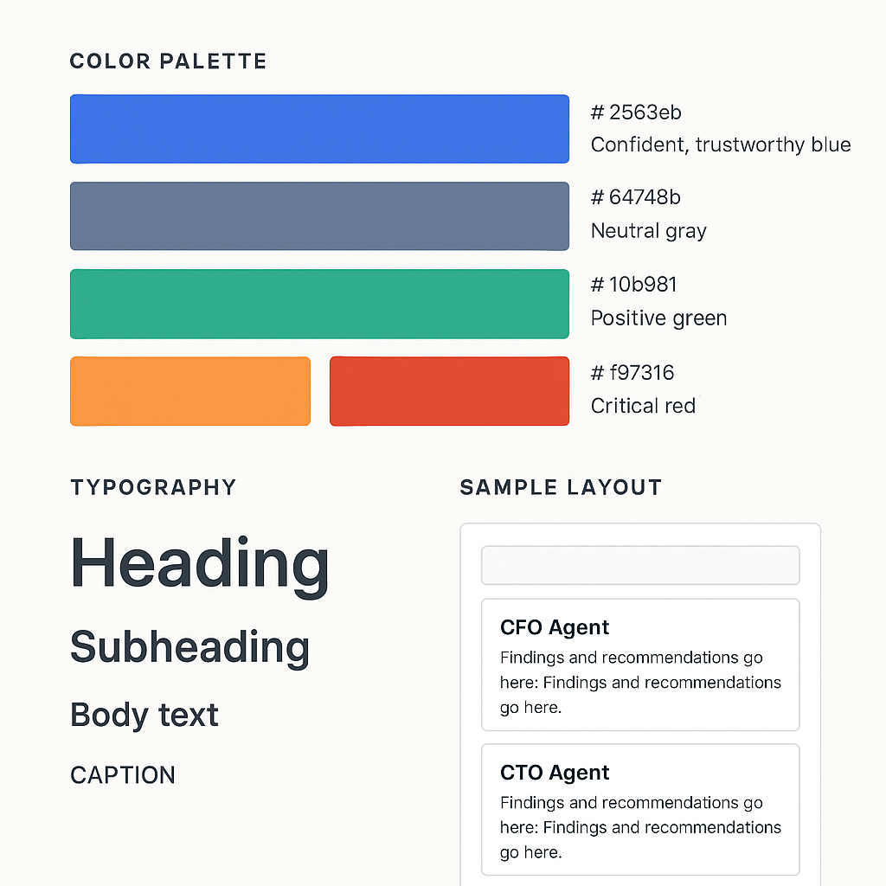

# Brand & Voice Guidelines for "the_board"

## 1. Brand Identity & Voice

The system is an **Expert Collaborator**. It embodies the collective intelligence of an executive boardroom, providing clarity, rigor, and actionable insight.

* **Primary Adjectives:** Authoritative, Insightful, Clarifying, Professional, Efficient, Reassuring.
* **Tone:** Resembles consulting a top-tier strategy firm. Confident but not arrogant. Explains complexity clearly, with depth and precision.
* **Metaphor:** A "Board of Directors" for your ideas — each agent is a specialist executive offering perspective.

### Do’s

* Speak with clarity, precision, and confidence.
* Reference “agents” and “analysis” to reinforce the board metaphor.
* Provide actionable recommendations, not vague summaries.

### Don’ts

* Do not use casual filler (“Hey…”, “kinda”, “bot”).
* Do not frame responses as “AI guesses.”
* Avoid jargon-heavy or overly academic phrasing.

---

## 2. User Experience (UX) & Interaction

* **Principle:** Complexity is power, but simplicity is the interface.
* **Flow:** Single input → orchestration → multi-agent analysis → synthesized output.
* **Interaction Model:**
  * Minimal user friction: one query in, one synthesized report out.
  * Error prompts are guiding, never blocking:  
    *Example: “I need more context to route this effectively. Could you clarify if this is for a product launch or a market expansion?”*
* **Accessibility:** Meet WCAG AA standards; ensure screen-reader and keyboard navigation compatibility.

---

## 3. Terminology & Messaging

* **Preferred Terms:**  
  * “The Board” (brand/system name)  
  * “Agent” (e.g., *The CFO Agent is analyzing your financials*)  
  * “Orchestration Engine” (CEO Agent)  
  * “Synthesis,” “Query,” “Analysis,” “Response”  

* **Avoided Terms:**  
  * “AI,” “Bot,” “Chatbot,” “LLM” in user-facing contexts  
  * Overly casual phrasing  

* **Error & System Messages:**  
  * **Do:** “The CTO Agent needs more technical context. Could you specify your stack or tools?”  
  * **Don’t:** “I can’t do that.”

---

## 4. Visual Identity

* **Color Palette:**
  * **Primary:** `#2563eb` (Confident, trustworthy blue)
  * **Secondary:** `#64748b` (Neutral, steady gray)
  * **Accent:** `#10b981` (Positive, growth-oriented green)
  * **Error/Warning:** `#f97316` (Caution orange), `#dc2626` (Critical red)

* **Typography:**
  * Primary: `Inter, -apple-system, BlinkMacSystemFont, "Segoe UI", sans-serif`
  * Backup: System UI fonts for maximum readability
  * Style: Professional, modern, and legible at all scales

* **Layout & Spacing:**
  * Use a consistent 4px or 0.5rem spacing grid
  * Prioritize white space for clarity
  * Minimalist card layouts for agent responses

* **Iconography:**
  * Subtle, not playful. Each agent may have a distinct, simple icon (e.g., finance symbol for CFO).

---

## 5. Logging & Output Style

* **Console/Developer Logs:**  
  * Branded headers: `[the_board | CFO] Analysis started…`  
  * Consistent prefixes: `[AgentType]`, `[StateStore]`, `[Synthesis]`  
  * Color-coded logs (blue = info, green = success, yellow = warning, red = error)

* **User-Facing Output:**  
  * Structured into **Findings**, **Risks**, **Opportunities**, **Recommendations**.  
  * Attribute insights to agents when relevant (e.g., “The CGO highlights global expansion risks…”).

---

## 6. Cross-Document Alignment

* **TECHSPEC.md:** All voice and terminology must reinforce the orchestration engine metaphor:contentReference[oaicite:5]{index=5}.  
* **WORKFLOWS.md:** Developer-facing docs should mirror this brand tone, using agent-first language:contentReference[oaicite:6]{index=6}.  
* **DEPLOYMENT.md:** Developer instructions remain technical, but branded logging/messages still apply:contentReference[oaicite:7]{index=7}.  
* **dataModel.py:** Naming conventions (AgentType, SynthesizedOutput) must match the terminology here:contentReference[oaicite:8]{index=8}.

---

## 7. Example Outputs

**Good (Aligned with Brand):**
> *The CFO Agent reports strong financial health, citing consistent growth in quarterly earnings. The CTO Agent identifies a potential scaling bottleneck in your current stack. The CEO Agent synthesizes these findings: your expansion is viable, but requires infrastructure investment first.*

**Bad (Misaligned):**
> *AI says your finances look okay but you should fix servers.*

---

## 8. Brand Promise

**the_board** represents structured intelligence. Every interaction should feel like a **boardroom strategy session** distilled into an accessible, professional advisory output.
