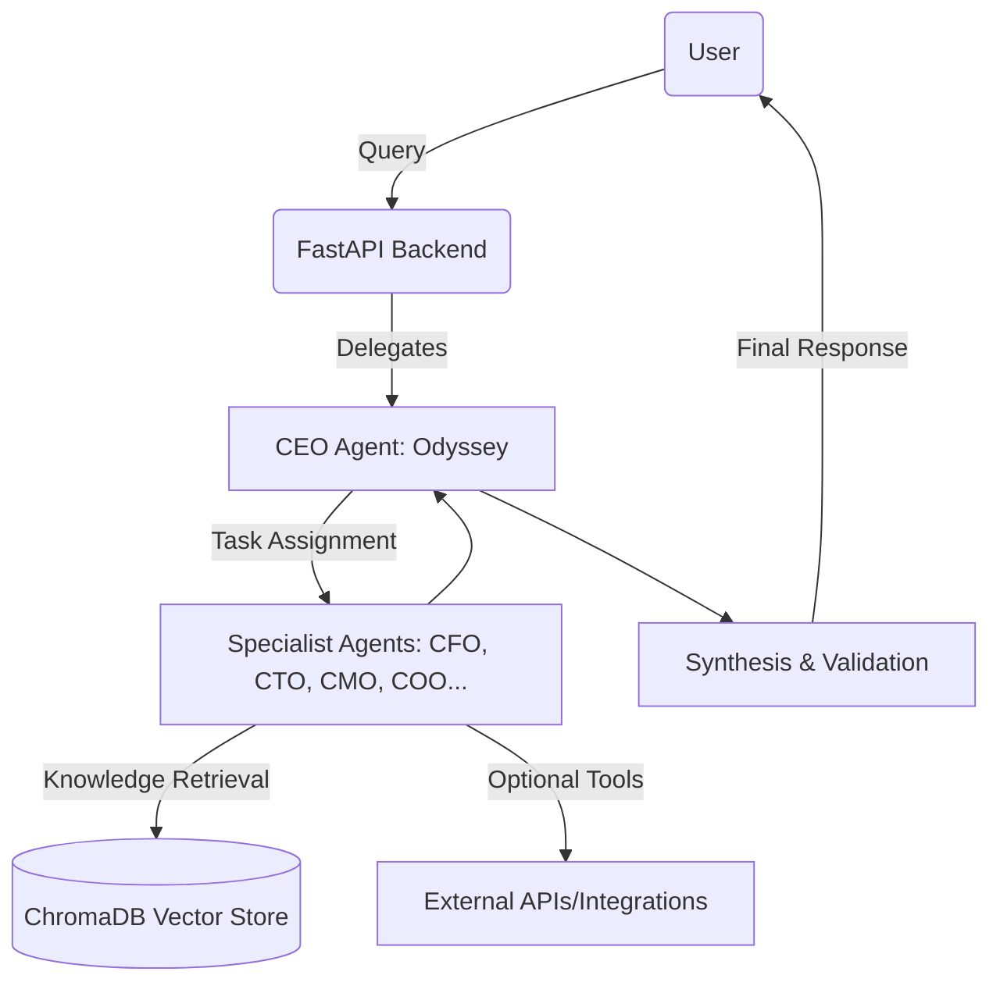

# Technical Specification: *the\_board* (v2.0)

## 1. System Architecture

**Pattern:** Multi-Agent Orchestration with Centralized Knowledge (Hub-and-Spoke).
**Overview:**
The system is powered by a FastAPI backend serving as the orchestration hub. A **CEO Agent** (“Odyssey”) interprets user queries, dynamically selects specialist agents, and coordinates execution. Agents interact with a shared knowledge base (**ChromaDB**), external tools, or APIs. A synthesis layer reconciles results into a unified, branded response.

---

## 2. Core Components

### FastAPI Backend

* Entry point (`src/main.py`).
* API contracts defined with **Pydantic v2** models.
* Swagger UI available for testing (`/docs`).
* Primary endpoint:

  * `POST /plan` → input: `OdysseyGoalRequest`, output: `FinalPlan`.

### Orchestration Engine (CEO Agent)

* Routes tasks to relevant agents.
* Supports parallelization, retry, and fallback.
* Escalation to human-in-the-loop when needed.
* Logs decision trails for transparency.

### Specialist Agents

* Implemented under `src/agents/`.
* Configured via `config/agents.json` (role, goals, expertise).
* Initial scope: **Essential Five** → CEO, CFO, CTO, CMO, COO.
  Expand incrementally.

### Knowledge Layer ✅ **COMPLETED**

* Vector database: **ChromaDB** (persisted locally).
* Embeddings: configurable (`.env`), default `mxbai-embed-large`.
* Ingestion workflow:

  1. New document arrives.
  2. Curation agent validates relevance.
  3. Embed + store in ChromaDB.
  4. Record provenance (source, timestamp, tags).

### RAG Integration ✅ **COMPLETED & OPERATIONALIZED**

* **Knowledge Ingestion Pipeline** (`src/knowledge/ingest.py`):
  - Document processing, chunking, and embedding
  - Support for PDF and other document formats
  - Configurable text splitting with overlap
  - **Real ChromaDB integration with error handling**

* **Knowledge Retrieval Service** (`src/knowledge/retriever.py`):
  - Semantic search using vector embeddings
  - Top-k retrieval with configurable result count
  - Singleton pattern for app-wide access
  - **Real Ollama embeddings with production error handling**

* **Agent RAG Workflows**:
  - Retrieve → Augment → Generate patterns
  - Dynamic context retrieval during task execution
  - Graceful fallback when no context available
  - Higher confidence scores for knowledge-grounded responses

### User Interface ✅ **COMPLETED**

* **Streamlit Web Application** (`src/ui/streamlit_app.py`):
  - Material Design-inspired aesthetics
  - Strategic goal submission interface
  - Real-time plan execution monitoring
  - Knowledge base management interface
  - Responsive layout with sidebar navigation

### Synthesis Layer ✅ **COMPLETED**

* **CEO Agent Synthesis** (`src/orchestration/synthesizer.py`):
  - Consolidates individual agent analyses into cohesive strategic plans
  - Identifies cross-functional risks and opportunities
  - Generates executive summaries and actionable recommendations
  - Integrates with orchestration workflow for automatic synthesis
  - Saves final plans to database and marks plans as closed

### Model Runtime

* **Ollama** for local inference (default: `llama3.2`).
* Optional fallback: Hugging Face Hub, Torch Hub, or TF Hub.
* Supports **model pinning** and quantization for reproducibility/latency.

### Synthesis Layer

* Validates and merges agent responses.
* Conflict resolution: structured debate → consensus scoring → fallback to CEO → escalate to user if unresolved.
* Applies **brand formatting** to outputs.

---

## 3. Data Models (API Contracts)

Defined in `dataModel.py`.

* **OdysseyGoalRequest** → `high_level_goal`, optional `user_context`.
* **AgentTask** → `task_id`, `agent_codename`, `task_description`, `status`, `result`.
* **AgentResponse** → `agent_type`, `analysis`, `confidence`, `citations[]`.
* **FinalPlan** → `synthesized_strategy (md)`, `contributing_agents[]`, `identified_risks[]`, `confidence_score`.
* **ErrorReport** → for escalations.
* **UserCorrection** → for feedback loop.
* **SynthesizedOutput (legacy)** retained temporarily for back-compat.

**Parsing rule:** when calling models, request JSON mode explicitly (e.g., `format="json"` with Ollama).

---

## 4. Orchestration & Workflow

* **Agent Selection:** CEO selects only minimal relevant agents (no default fan-out).
* **Parallel Execution:** `asyncio` for lightweight tasks; job queue/executor for heavy jobs.
* **Conflict Resolution Protocol:**

  1. Agents respond.
  2. Debate round (counter-arguments).
  3. Consensus score calculated.
  4. CEO adjudicates or escalates.
* **Error Handling:** retry once → escalate with branded error (`ErrorReport`).
* **Feedback Loop:** record `UserCorrection`, update routing heuristics.

---

## 5. Brand Adapter Layer

* **Formatting:** raw agent outputs → executive-style Markdown/PDF/DOCX via templates.
* **Confidence Phrasing:**

  * ≥ 0.80 → “high confidence”
  * 0.50–0.79 → “moderate confidence”
  * < 0.50 → “uncertain; human review advised”
* **Logging:** `[AGENT | icon | level] message` with brand palette.
* **Citations:** always rendered in a **References** section.

---

## 6. UI Layer

* **MVP:** Streamlit or FastAPI+Jinja page with branding (logo, palette, typography).
* **Production:** FastAPI + HTMX + Server-Sent Events for real-time orchestration updates (task state, logs, consensus score).
* **Exports:** PDF, DOCX, Markdown (using templates).

---

## 7. Deployment Alignment

### Environment Variables (`.env`)

* `OLLAMA_BASE_URL` (default `http://localhost:11434`)
* `PRIMARY_LLM` (default `llama3.2`)
* `EMBEDDING_MODEL` (default `mxbai-embed-large`)
* `CHROMA_PERSIST_DIRECTORY` (e.g., `./chroma_db`)
* `STATE_BACKEND` (default `sqlite`)
* `STATE_DB_PATH` (default `./state/the_board_state.db`)
* `API_PORT` (default `8000`)
* `LOG_LEVEL` (default `INFO`)
* `CACHE_SIZE`, `GPU_ENABLED` (0/1)

### Startup Sequence

1. Verify `.env` and persistence directories.
2. Launch Ollama & preload models.
3. Start FastAPI with Uvicorn.
4. Run health checks: Ollama, ChromaDB, agent registry, state layer.

### Containerization

* **Dockerfile + docker-compose** for local dev.
* Optional GPU runtime (NVIDIA).

### Persistence & Backups

* Mount volumes for `chroma_db/`, `state/`, and `logs/`.
* Daily snapshots → `/backups/` (retention: 30 days).
* Log rotation at 500 MB or 30 days.

### Networking

* FastAPI on port **8000**.
* Optional nginx reverse proxy + TLS (self-signed for dev).

### Monitoring

* `/health` endpoint → reports Ollama, ChromaDB, agent registry, state store.
* Lightweight metrics dashboard.

### Scalability

* **MVP:** Docker Compose (single user).
* **V1+:** Kubernetes + Helm + RBAC (multi-user/team).

---

## 8. Security & Privacy

* Local-first inference by default.
* Role-based access planned.
* Provenance tracked for all ingested data.
* Approval required before ingesting new sources.
* HTTPS enforced beyond localhost.

---

## 9. Current Implementation Status ✅ **UPDATED**

**the_board** has achieved significant milestones in its development:

### ✅ **Completed Components**
- **State Management** - Complete SQLite-based state store with WAL mode
- **Orchestration Engine** - Full task orchestration and execution management
- **LLM Integration** - Ollama-powered agents with specialized system prompts
- **RAG Integration** - Complete knowledge retrieval and augmentation workflows ✅ **OPERATIONALIZED**
- **API Framework** - FastAPI backend with comprehensive endpoint coverage
- **User Interface** - Beautiful Material Design-inspired Streamlit UI ✅ **COMPLETED**
- **Synthesis Layer** - CEO agent synthesis and final plan generation ✅ **COMPLETED**

### 🚧 **In Development**
- **Agent Specialization** - Expanding beyond the core 5 agents to full 20-agent system
- **Advanced Synthesis** - Conflict resolution and consensus building mechanisms
- **Performance Optimization** - Parallel execution and advanced caching

### 📋 **Planned Features**
- **Real-time Collaboration** - Multi-user support and concurrent planning
- **Advanced Analytics** - Performance metrics and decision tracking
- **Integration APIs** - Third-party tool and service connections

## 10. Roadmap

* **MVP (Month 1–2):** CEO orchestration, Essential Five, ChromaDB, Brand Adapter, basic UI, Synthesis Layer. ✅ **COMPLETED**
* **V1.1 (Month 3–4):** HTMX/SSE dashboard, full AgentTask handling, feedback loop, export templates.
* **Year 1:** Multi-modal input, simulation engine, Kubernetes scale-out, plugin ecosystem.

---

## Appendix: Agent Glossary

For quick reference, here are the agents and their core roles:

* **Odyssey (CEO):** Oversees orchestration, decomposes goals, delegates tasks.  
* **Momentum (COO):** Execution, operations, and workflow management.  
* **Abacus (CFO):** Budgeting, finance, and economic modeling.  
* **Nexus (CTO):** Technical evaluations, system architecture, tooling.  
* **Curio (Chief Researcher):** Maintains and updates knowledge base (ChromaDB).  
* **Muse (CMO):** Marketing, outreach, and messaging.  
* **Guardian (CISO):** Security, compliance, and risk oversight.  
* **Pulse (CHRO):** Organizational design, HR, team dynamics.  
* **Insight (CIO):** Data strategy, analytics, and information flow.  
* **Envoy (Chief Diplomat):** Partnerships, negotiations, and external relations.  
* **Vision (Chief Strategist):** Long-term positioning and strategic foresight.  
* **Forge (Chief Engineer):** Prototyping, builds, infrastructure.  
* **Beacon (Chief Ethicist):** Ethical safeguards, fairness, and alignment.  
* **Flux (Chief Innovator):** Disruption scanning, innovation scouting.  
* **Anchor (Chief Legal Officer):** Legal, contracts, compliance.  
* **Scribe (Chief Knowledge Officer):** Documentation, structuring outputs.  
* **Spark (Chief Creative Officer):** Creative design, storytelling, branding.  
* **Vector (Chief Logistics Officer):** Resource allocation and distribution.  
* **Echo (Chief Communications Officer):** Public relations and messaging tone.  
* **Horizon (Chief Sustainability Officer):** ESG and sustainability strategy.

✅ This is the **updated TECHSPEC.md** reflecting the completed Synthesis Layer and core architecture. It is now comprehensive, consistent, and aligned with all updated documentation. 12/2024
